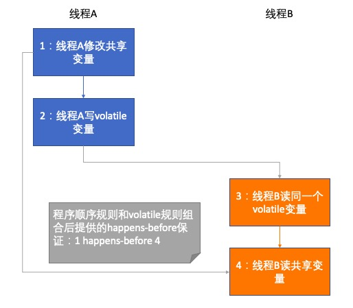
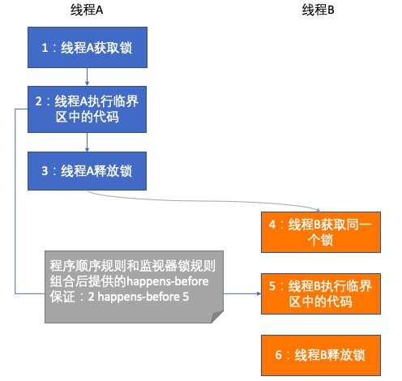
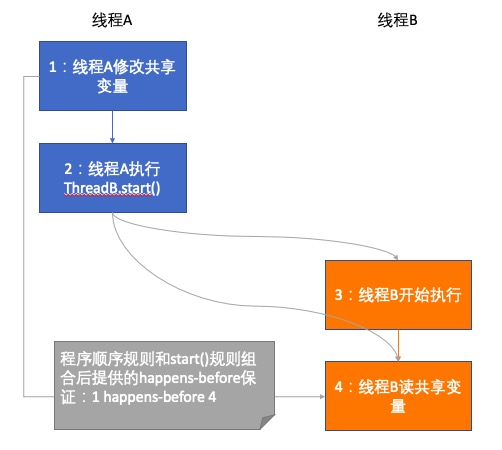
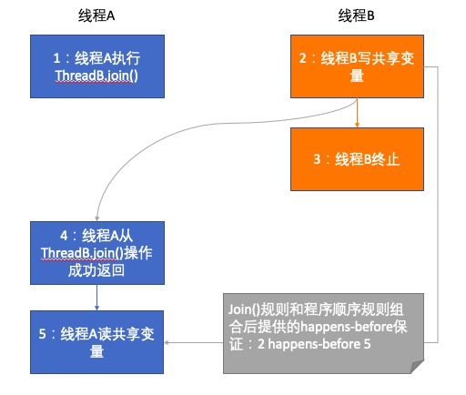

# JMM（Java内存模型）

## Happens-Before规则

《JSR-133：Java Memory Model and Thread Specification》中对happens-before关系的定义如下：

> (1) 如果一个操作happens-before另一个操作，那么第一个操作的执行结果将对第二个操作可见，而且第一个操作的执行顺序排在第二个操作之前。

> (2) 两个操作之间存在happens-before关系，并不意味着Java平台的具体实现必须要按照happens-before关系指定的顺序来执行。如果重排序之后的执行结果与按
happens-before关系来执行的结果一致，那么这种重排序并不非法（也即是说，JMM允许这种重排序）

以上(1)是JMM对程序员的承若，(2)是JMM对编译器和处理器重排序的约束原则。

《JSR-133：Java Memory Model and Thread Specification》定义了如下happens-before规则：

* (1) 程序顺序规则：一个线程中，按照程序顺序，前面的操作 happens-before 于该线程中后续的任意操作。

* (2) volatile变量规则：对一个volatile域的写操作，happens-before 于后续对这个volatile域的读操作。

* (3) 传递性规则：如果 A happens-before B，且 B happens-before C，那么 A happens-before C。

* (4) 监视器锁规则：对一个锁的解锁，happens-before 于后续对这个锁的加锁。

* (5) start()规则：如果线程A执行操作ThreadB.start()（即在线程A中启动线程B），那么线程A的ThreadB.start()操作 happens-before 于线程B中的任意操作。也即线程B能够看到线程A在启动线程B前的操作。

* (6) join()规则：如果线程A执行操作ThreadB.join()并成功返回，那么线程B中的任意操作 happens-before 于线程A从ThreadB.join()操作成功返回。也即线程B完成后（从线程A中join()返回），线程A能够看到线程B的操作。

## volatile变量规则图解

> 1 happens-before 2 和 3 happens-before 4 由程序顺序规则产生；2 happens-before 3 由volatile规则产生，所以 1 happens-before 4 是由传递性规则产生。

## 监视器锁规则图解

> 1->2、2->3、4->5、5->6 由程序顺序规则产生；3 happens-before 4 由监视器锁规则产生；根据传递性，将有 2 happens-before 5。这也意味着线程A在释放锁之前所有可见的共享变量，在线程B获取同一个锁之后，将立即变得对线程B可见。

## start()规则图解

> 1 happens-before 2 由程序顺序规则产生；2 happens-before 4 由start()规则产生；根据传递性，将有 1 happens-before 4。这也意味着线程A在执行ThreadB.start()之前对共享变量所做的修改，接下来在线程B开始执行后都将确保对线程B可见。

👉 [点击查看 StartExample 示例代码](../../java/org/concurrency/happensbefore/StartExample.java)

## join()规则图解

> 2 happens-before 4 由join()规则产生；4 happens-before 5 由程序顺序规则产生；根据传递性，将有 2 happens-before 5。这也意味着线程A执行操作ThreadB.join()并成功返回后，线程B中的任意操作都对线程A可见。

👉 [点击查看 JoinExample 示例代码](../../java/org/concurrency/happensbefore/JoinExample.java)