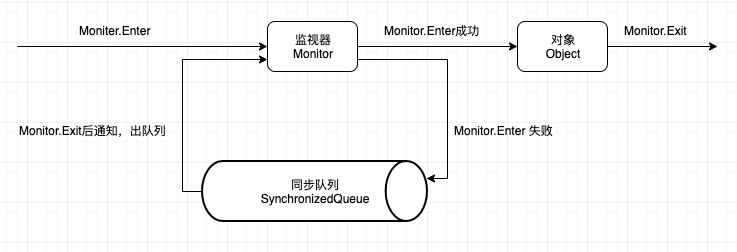

# Java线程基础

## 线程的生命周期

### [线程的状态][1]

```java
public class Thread implements Runnable {
    
    public enum State {
            NEW,
            RUNNABLE,
            BLOCKED,
            WAITING,
            TIMED_WAITING,
            TERMINATED;
        }
}
```

| 状态名称 | 状态说明 |
| ------- | ------- |
| NEW | 初始状态，线程被构建，但还没有调用start()方法 |
| RUNNABLE | 可运行状态，表示当前线程可能正在运行，也有可能正在等待CPU时间片，Java线程系统将操作系统中的就绪（Ready）和运行（Running）两种状态统称为"可运行"|
| BLOCK | 阻塞状态，表示当前线程阻塞于锁 |
| WAITING | 无限期等待状态，表示当前线程进入等待状态，进入该状态的线程需要等待其他线程做出一些特定动作（通知或中断）|
| TIMED_WAITING | 有限期等待状态，无需等待其他线程做出特定动作，在一定时间期限后会被系统自动唤醒 |
| TERMINATED | 终止状态，表示当前线程执行完毕，可能是任务完成之后自己结束，也可能是产生异常而结束 |

*只要 Java 线程处于 BLOCKED、WAITING、TIMED_WAITING 这三种状态之一，那么这个线程就永远没有CPU的使用权*

### 线程状态的变迁

线程状态的生命周期可以简化为下图：

```sh

    +------------+
    |     NEW    |   
    +------------+
           ↓          +---------------+
    +------------+    |    BLOCKED    |
    |  RUNNABLE  | ←→ |    WAITING    |
    +------------+    | TIMED_WAITING |
           ↓          +---------------+
    +------------+
    | TERMINATED |
    +------------+    

```

1. [NEW 到 RUNNABLE][2]

通过调用线程对象的`start()`方法

2. [RUNNABLE 与 BLOCKED 的转换][3]

只有一种场景会触发这种转换，那就是线程等待`synchronized`的隐式锁。`synchronized`修饰的方法、代码块同一时刻只允许一个线程执行，其他线程只能等待，
这种情况下，等待的线程就会从 RUNNABLE 转换到 BLOCKED；而当等待的线程获得`synchronized`的隐式锁后，就会从 BLOCKED 转换到 RUNNABLE。

3. [RUNNABLE 与 WAITING 的转换][4]

三种场景触发这种转换：

| 进入方式 | 退出方式 |
| --- | --- |
| 获得 synchronized 隐式锁的线程，调用不带超时参数的 `Object.wait()` 方法 | 其他线程调用 `Object.notify()` / `Object.notifyAll()` 唤醒线程 |
| 调用不带超时参数的 `Thread.join()` 方法 | 被调用的线程执行完毕 |
| 调用 `LockSupport.park()` 方法 | 其他线程调用 `LockSupport.unpark(Thread thread)` 唤醒目标线程 | 

4. [RUNNABLE 与 TIMED_WAITING 的转换][5]

五种场景触发这种转换：

| 进入方式 | 退出方式 |
| --- | --- |
| 调用 `Thread.sleep(long millis)` 方法 | 时间结束 |
| 获得 synchronized 隐式锁的线程，调用带超时参数的 `Object.wait(long timeout)` 方法 | 时间结束 / 其他线程调用 `Object.notify()` / `Object.notifyAll()` 唤醒线程 |
| 调用带超时参数的 `Thread.join(long millis)` 方法 | 时间结束 / 被调用的线程执行完毕 |
| 调用带超时参数的 `LockSupport.parkNanos(Object blocker, long deadline)` 方法 | `LockSupport.unpark(Thread thread)` |
| 调用带超时参数的 `LockSupport.parkUntil(long deadline)` 方法 | `LockSupport.unpart(Thread thread)` |

5. RUNNABLE 到 TERMINATED

线程执行完 `run()` 方法后，会自动转换成 TERMINATED 状态；如果执行 `run()` 的时候抛出异常，也会导致线程终止。

*注意：如果我们想人为终止线程，Thread类里面提供了一个`stop()`方法，但是已被标注为`@Deprecated`，正确的方法应该是调用`interrupt()`方法*


👉 [点击查看 TreadStateDemo 示例代码](../../java/org/concurrency/thread/ThreadStateDemo.java)

## 线程的使用

### 线程的初始化

通过源码分析一个线程的初始化：

```java
public class Thread {
    
    /**
     * 初始化线程
     */
    private void init(ThreadGroup g, Runnable target, String name,
                      long stackSize, AccessControlContext acc) {
        if (name == null) {
            throw new NullPointerException("name cannot be null");
        }
        this.name = name;
        //当前线程是该线程的父线程
        Thread parent = currentThread();
        
        //...中间省略...
        
        //设置线程组
        this.group = g;
        //将当前线程的daemon、priority属性设置为父线程相同的属性
        this.daemon = parent.isDaemon();        //是否为守护线程
        this.priority = parent.getPriority();   //线程优先级
        if (security == null || isCCLOverridden(parent.getClass()))
            this.contextClassLoader = parent.getContextClassLoader();
        else
            this.contextClassLoader = parent.contextClassLoader;    //设置为父线程的contextClassLoader
        this.inheritedAccessControlContext =
                acc != null ? acc : AccessController.getContext();
        this.target = target;                                       //设置runnable
        setPriority(priority);
        //复制父线程的inheritableThreadLocals
        if (parent.inheritableThreadLocals != null)
            this.inheritableThreadLocals =
                ThreadLocal.createInheritedMap(parent.inheritableThreadLocals);
        this.stackSize = stackSize;

        tid = nextThreadID();   //设置新线程ID
    }
}
```

由此可见，一个新线程（子线程）的初始化是继承了父线程是否为daemon、优先级、contextClassLoader 和 inheritableThreadLocals，
同时分配一个唯一ID来标识新线程。至此，一个新线程就初始化完成，在堆内存中等待运行。

### 线程的实现

三种方式实现线程：

1. 实现 Runnable 接口
    
需要实现`run()`方法，并通过 Thread 调用`start()`方法来运行`run()`方法

2. 继承Thread类
    
同样也需要重写`run()`方法，因为 Thread 实际是实现了 Runnable 接口
    
```java
public class Thread {
    private Runnable target;
    @Override
    public void run() {
        if (target != null) {
            target.run();
        }
    }
}
```

3. 实现 Callable 接口

需要实现`call()`方法，与 Runnable 相比，Callable可以有返回值，返回值通过 FutureTask 进行封装
    
```java
public interface Callable<V> {
    V call() throws Exception;
}
```

Runnable和Thread的选择

1. java不支持多重继承，如果继承了Thread类就无法再继承其他类，但是java支持实现多个接口

2. 如果类只需要可执行就可以，继承整个Thread类开销太大

👉 [点击查看 ThreadImplDemo 示例代码](../../java/org/concurrency/thread/ThreadImplDemo.java)


### 线程的中断和终止

通过调用线程的`interrupt()`中断线程，如果该线程处于 WAITING 或 TIMED_WAITING 状态时（如调用了`Object.wait()`、`Object.wait(long)`、
`Object.join()`、`Object.join(long)`、`sleep(long)`等），那么会抛出`InterruptedException`，并且*中断状态会被清除*

👉 [点击查看interrupt()方法文档][6]

如果一个线程的`run()`方法执行一个无限循环，并且没有执行会抛出`InterruptedException`的操作，那么调用该线程的`interrupt()`方法就无法使线程提前结束。
但是`interrupt()`方法会设置一个中断状态，此时线程可以通过`isInterrupted()`或者调用静态方法`Thread.interrupted()`来检查线程是否被中断。

*其中`Thread.interrupted()`方法会清除当前线程的中断状态。*

👉 [点击查看 ThreadInterruptedStatusDemo 示例代码](../../java/org/concurrency/thread/ThreadInterruptedStatusDemo.java)

由于`stop()`方法被标注为了`@Deprecated`，所以除了中断以外，还可以利用一个`volatile`类型的`boolean`变量来控制是否需要停止任务并终止该线程。

👉 [点击查看 ThreadShutdownDemo 示例代码](../../java/org/concurrency/thread/ThreadShutdownDemo.java)

### 线程间的协作

#### volatile 和 synchronized

* volatile关键字可以用来修饰字段（成员变量），就是告知程序任何对该变量的访问均需从共享内存中获取，而对它的改变也必须同步刷新回共享内存，它能保证所有线程对变量访问的**可见性**。

* synchronized关键字可以修饰方法或者以代码同步块的形式来进行使用，主要确保多个线程在同一时刻，只能有一个线程处于方法或者代码同步块中，它保证了线程对变量访问的**可见性**和**排他性**。

以下对👉 [点击查看 SynchronizedDemo 示例代码](../../java/org/concurrency/thread/SynchronizedDemo.java)使用javap工具查看生成的class文件来分析synchronized关键字的实现细节：

```sh

➜ javap -v SynchronizedDemo.class
Classfile /Users/kyan/Workspace/myworkspace/java-concurrency-notes/target/classes/org/concurrency/thread/SynchronizedDemo.class
  Last modified May 8, 2019; size 606 bytes
  MD5 checksum 2596f216b9e4121827bb5f26aa02f945
  Compiled from "SynchronizedDemo.java"
public class org.concurrency.thread.SynchronizedDemo
  省略...

  public static void main(java.lang.String[]);
    descriptor: ([Ljava/lang/String;)V
    flags: ACC_PUBLIC, ACC_STATIC
    Code:
      stack=2, locals=3, args_size=1
         0: ldc           #2                  // class org/concurrency/thread/SynchronizedDemo
         2: dup
         3: astore_1
         4: monitorenter                        //注：获取锁
         5: aload_1
         6: monitorexit                         //注：释放锁
         7: goto          15
        10: astore_2
        11: aload_1
        12: monitorexit
        13: aload_2
        14: athrow
        15: invokestatic  #3                  // Method m:()V
        18: return
  
  省略... 
     
  public static synchronized void m();
    descriptor: ()V
    flags: ACC_PUBLIC, ACC_STATIC, ACC_SYNCHRONIZED
    Code:
      stack=0, locals=0, args_size=0
         0: return
      LineNumberTable:
        line 18: 0
}

```

可以发现代码同步块的实现是通过`monitorenter`和`monitorexit`指令，而同步方法则是依靠方法修饰符上的`ACC_SYNCHRONIZED`来实现。
无论采用哪种方式，其本质都是对一个对象（Object）的监视器（Monitor）进行获取，而这个获取过程是排他的。

> 任意线程对由synchronized保护的Object的访问，首先要获得Object的监视器。如果获取失败，线程进入同步队列（SynchronizedQueue），线程状态变为BLOCKED。
当访问Object的前驱（获得了锁的线程）释放了锁，则该释放操作唤醒阻塞在同步队列中的线程，使其重新尝试对监视器的获取。

具体流程见下图：



### wait()、notify() 和 notifyAll()

等待通知机制：

> 一个线程调用了对象O的wait()方法进入等待状态（该线程被挂起）；而另一个线程调用了对象O的notify()或者notifyAll()方法来唤醒挂起的线程，
挂起的线程收到通知后从对象O的wait()方法返回，进而执行后续操作。

⚠️ 线程使用wait()方法进入等待状态后，线程会释放锁，这是因为如果不释放锁，其他线程就无法进入对象的同步方法或同步块中，
那么就无法执行notify()或notifyAll()来唤醒等待状态中的线程，造成死锁。

wait()/notify()/notifyAll()方法的说明

|方法名称|说明|
|----|----|
|wait()|通过调用对象的wait()方法，线程进入WAITING状态，只有等待其他线程的通知或被中断才会返回；调用wait()方法后，该线程会释放对象的锁；|
|wait(long)|超时等待，时间参数是毫秒，也就是等待长达n毫秒，如果没有通知就超时返回；|
|wait(long,unit)|对于超时时间更加细粒度的控制，可以达到纳秒；|
|notify()|通知一个在对象上等待的线程，使其从wait()方法返回，而返回的前提是线程获取到对象的锁；|
|notifyAll()|通知所有等待在该对象上的线程；|

⚠️ 以上方法是任意Java对象都具备的，因为这些方法被定义在所有对象的超类 java.lang.Object上

⚠️ wait()和sleep()的区别：wait()是Object的方法，而sleep()是Thread的静态方法；wait()会释放锁，而sleep()不会释放锁

👉 [点击查看 WaitNotifyDemo 示例代码](../../java/org/concurrency/thread/WaitNotifyDemo.java)


流程描述：wait-thread首先获得了对象的锁，然后调用对象的wait()方法，从而放弃了锁并进入了对象的等待队列（线程状态由RUNNING变为WAITING），进入等待状态。
由于wait-thread释放了锁，notify-thread随后获取到了对象的锁，并调用对象的notifyAll()方法，将wait-thread从等待队列迁移至同步队列（线程状态由WAITING变为BLOCKED），
等notify-thread释放锁后，wait-thread再次获取到锁并从wait()方法返回。

⚠️ 调用wait()/notify()/notifyAll()时需要注意的细节：

1. 调用wait()/notify()/notifyAll()时需要先对调用对象加锁（也就是说只能在同步方法或同步块中使用，否则会抛出`IllegalMonitorStateException`异常）

2. 调用wait()方法后，线程状态由RUNNING进入WAITING（线程挂起），并将当前线程放置到对象的*等待队列*

3. 调用notify()/notifyAll()方法后，等待线程依旧不会从wait()返回，需要等到调用notify()/notifyAll()的线程释放锁之后，等待的线程才有机会从wait()返回

4. notify()将等待队列中的一个等待线程从*等待队列*中移到*同步队列*中，而notifyAll()则是将等待队列中所有线程全部移到同步队列

5. 线程从wait()方法返回的前提是该线程获得了锁


### 参考

* 《Java并发编程的艺术》
* Java并发编程实战 by 极客时间


[1]: https://docs.oracle.com/javase/8/docs/api/java/lang/Thread.State.html
[2]: https://docs.oracle.com/javase/8/docs/api/java/lang/Thread.State.html#RUNNABLE
[3]: https://docs.oracle.com/javase/8/docs/api/java/lang/Thread.State.html#BLOCKED
[4]: https://docs.oracle.com/javase/8/docs/api/java/lang/Thread.State.html#WAITING
[5]: https://docs.oracle.com/javase/8/docs/api/java/lang/Thread.State.html#TIMED_WAITING
[6]: https://docs.oracle.com/javase/8/docs/api/java/lang/Thread.html#interrupt--

