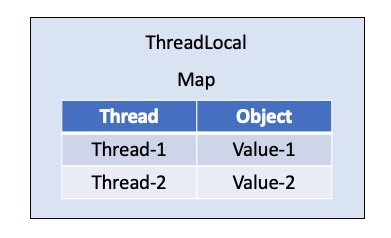
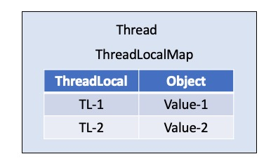

# ThreadLocal（线程本地变量）简介

## 为什么使用ThreadLocal

在多线程编程中我们为了解决线程安全问题通常会利用`synchronized`关键字或者J.U.C包中的锁来控制线程对临界区资源的操作。
但是这种加锁方式会让未获取到锁的线程进入阻塞状态，很显然这种方式的时间效率并不是很高。说到底多线程的并发问题都是由于多个线程共享同一资源所导致，
那么解决并发问题的一个重要方法就是：**避免共享**。

避免共享的解决思路：
> 每个线程都拥有自己的"共享资源"，这样就可以避免共享资源的竞争。

正如**局部变量是线程安全的**，其本质上也是属于避免共享。那么在Java线程级别上，则是通过Java提供的线程本地变量（ThreadLocal）来解决的。
可以想象，每个线程拥有了自己的本地变量后，无疑会使内存变大，但是由于不需要同步也就减少了线程阻塞等待的情况，由此提高时间效率，所以这是一种"**以空间换时间**"的方案。

## ThreadLocal的实现

假设让我们自己来设计`ThreadLocal`的实现，最容易想到的就是在`ThreadLocal`内部定义一个`Map`，以线程作为Key，每个线程拥有的变量作为Value，如下图：



👉 [点击查看 MyThreadLocal实现](../../java/org/concurrency/threadlocal/MyThreadLocal.java)

然而通过查看`Thread`和`ThreadLocal`源码我们发现Java的`ThreadLocal`设计并非如此。

Java的实现里面也有一个`Map`，叫做`ThreadLocalMap`，但是该`Map`并不是属于`ThreadLocal`的，而是属于`Thread`的：

```java
//From JDK1.8
public
class Thread implements Runnable {
    /* ThreadLocal values pertaining to this thread. This map is maintained
     * by the ThreadLocal class. */
    ThreadLocal.ThreadLocalMap threadLocals = null;
}
```

`ThreadLocalMap`是`ThreadLocal`类的一个静态类：

```java
//From JDK1.8
public class ThreadLocal<T> {
    
    static class ThreadLocalMap {
    
            /**
             * The entries in this hash map extend WeakReference, using
             * its main ref field as the key (which is always a
             * ThreadLocal object).  Note that null keys (i.e. entry.get()
             * == null) mean that the key is no longer referenced, so the
             * entry can be expunged from table.  Such entries are referred to
             * as "stale entries" in the code that follows.
             */
            static class Entry extends WeakReference<ThreadLocal<?>> {
                /** The value associated with this ThreadLocal. */
                Object value;
    
                Entry(ThreadLocal<?> k, Object v) {
                    super(k);
                    value = v;
                }
            }
    }
}
```

可以发现`ThreadLocalMap`的Key是`ThreadLocal`，而不是我们设计中的`Thread`。



所以Java中的ThreadLocal实现基本框架如下：

```java
class Thread {
    ThreadLocal.ThreadLocalMap threadLocals;
}

class ThreadLocal<T> {
    public T get() {
        //先获取当前线程的ThreadLocalMap
        ThreadLocalMap map = Thread.currentThread().threadLocals;
        //查找变量
        Entry e = map.getEntry(this);
        return e.value;
    }
    //ThreadLocalMap定义
    static class ThreadLocalMap {
        Entry[] table;
        Entry getEntry(ThreadLocal key) {
            //查找逻辑
        }
        //Entry定义
        static class Entry extends WeakReference<ThreadLocal> {
            Object value;
        }
    }
}
```

显然Java中的`ThreadLocal`设计更加合理也更加容易理解，因为`ThreadLocal`仅仅是个代理工具类，内部并不持有任何和线程相关的数据，所有和线程相关的数据都储存在`Thread`里面。

## ThreadLocal的源码分析

> `set(T value)`方法：

```java
public void set(T value) {
    //获取当前线程
    Thread t = Thread.currentThread();
    //获取当前线程拥有的ThreadLocalMap
    ThreadLocalMap map = getMap(t);
    if (map != null)
        //如果map不为空，则已当前ThreadLocal实例为key，存入value
        map.set(this, value);
    else
        //如果map为空，新建ThreadLocalMap并存入value
        createMap(t, value);
}
```

> 其中`getMap(t)`返回当前线程Thread的ThreadLocalMap：

```java
ThreadLocalMap getMap(Thread t) {
    //每个Thread都拥有自己的ThreadLocalMap
    return t.threadLocals;
}
```

> `createMap(t, value)`方法的具体实现：

```java
void createMap(Thread t, T firstValue) {
    //new一个ThreadLocalMap实例，然后以当前ThreadLocal实例作为key，firstValue为值
    //存放到ThreadLocalMap中，然后将当前线程对象的threadLocals赋值为该ThreadLocalMap实例
    t.threadLocals = new ThreadLocalMap(this, firstValue);
}
```

> `T get()`方法：

```java
public T get() {
    //获取当前线程
    Thread t = Thread.currentThread();
    //获取当前线程拥有的ThreadLocalMap
    ThreadLocalMap map = getMap(t);
    if (map != null) {
        //如果map不为空，获取当前ThreadLocal实例为key的值的entry
        ThreadLocalMap.Entry e = map.getEntry(this);
        if (e != null) {
            @SuppressWarnings("unchecked")
            //entry不为空，则返回相应的value
            T result = (T)e.value;
            return result;
        }
    }
    //如果map为空或者entry为空，通过以下方法初始化，并返回该方法的返回值
    return setInitialValue();
}
```

> `setInitialValue()`

```java
private T setInitialValue() {
    //初始值，默认为null
    T value = initialValue();
    //获取当前线程
    Thread t = Thread.currentThread();
    //获取当前线程拥有的ThreadLocalMap
    ThreadLocalMap map = getMap(t);
    if (map != null)
        //如果map不为空，则已当前ThreadLocal实例为key，存入value
        map.set(this, value);
    else
        //如果map为空，新建ThreadLocalMap并存入value
        createMap(t, value);
    //返回初始值
    return value;
}
```

`setInitialValue()`方法逻辑和`set(T value)`方法几乎一致，唯一的区别在于`initialValue()`方法的调用。
该方法是`protected`方法，也就是说继承ThreadLocal的子类可以重写该方法，实现赋值为其他的初始值。

> `remove()`

```java
public void remove() {
    //获取当前线程拥有的ThreadLocalMap
    ThreadLocalMap m = getMap(Thread.currentThread());
    if (m != null)
        //如果map不为空，从当前map中删除已当前ThreadLocal实例为key的键值对
        m.remove(this);
}
```

## ThreadLocal vs synchronized

* 实现机制

ThreadLocal：通过让每个线程都拥有自己的本地变量而实现对资源的隔离，避免资源竞争，这是一种*空间换时间*的做法。

synchronized：通过对同一个对象的监视器（Monitor）进行获取（对同一资源的竞争），让不同的线程排队访问，这是一种*时间换空间*的做法。

## ThreadLocal的应用

1. 线程安全的[`SimpleDateFormat`][1]

我们知道`SimpleDateFormat`不是线程安全的，其Java文档中这么提示：

> Synchronization

> Date formats are not synchronized. It is recommended to create separate format instances for each thread. 
> If multiple threads access a format concurrently, it must be synchronized externally.

正如《阿里巴巴Java开发手册》中所强调的：

> 「强制」SimpleDateFormat是线程不安全的类，一般不要定义为static变量，如果定义为static，必须加锁，或者使用DateUtils工具类。亦推荐以下处理：
>  
```java
private static ThreadLocal<DateFormat> threadLocal = new ThreadLocal<DateFormat>() {
    @Override
    protected DateFormat initialValue() {
        return new SimpleDateFormat("yyyy-MM-dd");
    }
};
```

👉 [点击查看 UnsafeSimpleDateFormat示例代码](../../java/org/concurrency/threadlocal/UnsafeSimpleDateFormatDemo.java)

👉 [点击查看 SafeSimpleDateFormat示例代码](../../java/org/concurrency/threadlocal/SafeSimpleDateFormatDemo.java)


## 参考

* 《Java并发编程的艺术》
* Java并发编程实战 by 极客时间

[1]: https://docs.oracle.com/javase/8/docs/api/java/text/SimpleDateFormat.html